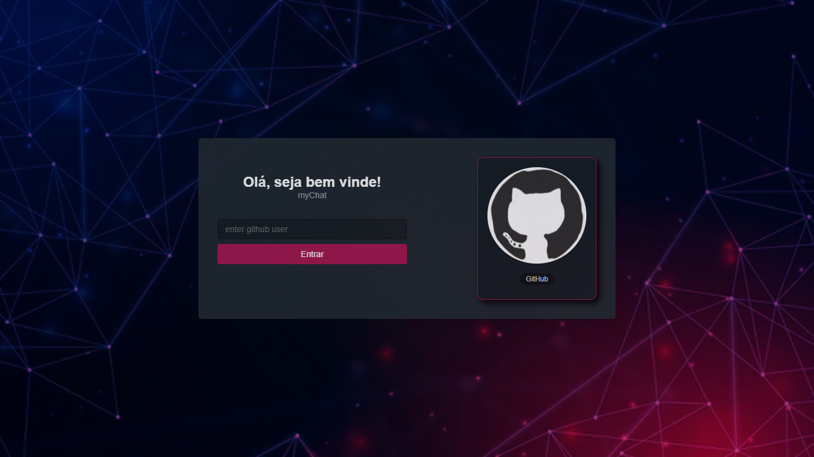
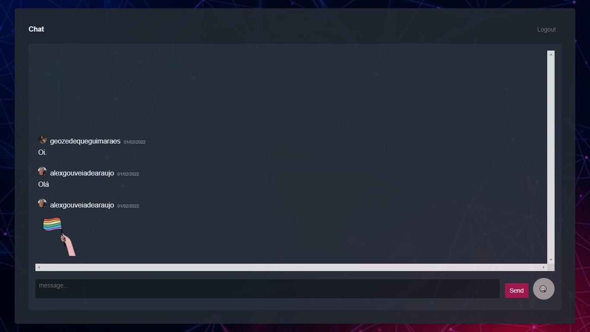

## myChat
Chat desenvolvido para troca de mensagens entre usuários github, onde são armazenadas em um banco de dados.

## Tecnologias
As seguintes ferramentas foram usadas na construção do projeto:

- [React](https://pt-br.reactjs.org)
- [Next](https://nextjs.org)
- [SkynexUI](https://skynexui.dev)
- [Supabase](https://supabase.com/)

## Página Login


## Página Chat


## Como executar o projeto:

1 - Acesse a pasta do projeto.

2 - Instale as dependências.

```
npm install 
```
ou
```
yarn add [package]
```

3 -  Execute a aplicação em modo de desenvolvimento.

```
npm run dev 
```

ou

``` 
yarn dev
```

---

Desenvolvedor: Alexsandro Araújo [Linkedin](hhttps://www.linkedin.com/in/alexsandro-ara%C3%BAjo-3a73961b9/?originalSubdomain=br)
